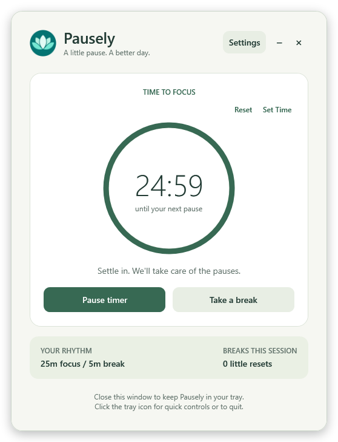

# Pausely

**A little pause. A better day.** A personal Pomodoro tray app for Windows, built with C#, .NET 10, and WPF.

Pausely gives you a quiet heads-up before a break, locks your Windows account when focus time ends, and reminds you to finish your break if you unlock early. It runs as an ordinary desktop application, with no Windows service, administrator privileges, account, or cloud connection.



## How it works

1. Open Pausely. A **25-minute focus session** starts by default.
2. **One minute before the break**, a small reminder appears at the bottom-right of your primary display. It doesn't take keyboard focus and closes after **6 seconds**.
3. At the end of focus time, Pausely invokes Windows' normal account lock, the same lock screen you use with **Win+L**.
4. Once Windows confirms the lock, your **5-minute break** begins.
5. Unlock early and a topmost **“Break not over yet”** window shows the remaining time. Choose **Lock again** to finish your break, or **Override** to end it and start a fresh focus session. The prompt closes automatically when the break ends.
6. If you stay locked until the break ends, the next focus session starts when you unlock, so you get the full focus interval.

Closing the dashboard keeps the app in your system tray. Double-click the lotus icon to reopen it; Single-click for pause/resume, take a break now, override, stop, settings, and quit. Windows may initially put the icon under the tray's **^** overflow menu.

The early-unlock prompt is a personal reminder, not an access restriction. It doesn't disable other applications, intercept keys, or replace Windows security. Alt+F4 keeps the prompt open; use **Override**, **Lock again**, wait for it to finish, or quit from the tray.

## Install for personal use

### Build a portable copy (recommended)

You need Windows 11 (x64 or ARM64) and the [.NET 10 SDK](https://dotnet.microsoft.com/download/dotnet/10.0) to build. The published self-contained application includes its runtime, so you don't need to install .NET separately to run that copy.

From PowerShell in the repository:

```powershell
powershell -NoProfile -ExecutionPolicy Bypass -File .\scripts\Publish.ps1
```

For an ARM64 laptop, append `-Runtime win-arm64`.

This creates:

```text
artifacts\publish\win-x64\Pausely.exe
artifacts\Pausely-win-x64.zip
```

1. Extract the ZIP to a permanent location, for example `%LOCALAPPDATA%\Programs\Pausely`.
2. Run **Pausely.exe**. No installer or elevation is needed.
3. Open **Settings** to choose your timing. Optionally enable **Launch in the tray when I sign in to Windows** and save.
4. If Windows hides the tray icon, drag it out of the overflow menu to keep the countdown tooltip within reach.

The build workflow also uploads `Pausely-win-x64.zip` as a GitHub Actions artifact after a successful run. This repository doesn't require you to publish a GitHub Release.

The personal build is unsigned. If Windows shows a downloaded-file warning, inspect the source/build provenance before choosing to run it. Startup registration is per user and points to the current executable, so enable it **after** moving the app to its permanent folder. If you move it later, open the new copy and save settings again.

### Run from source

```powershell
dotnet run --project .\src\Pausely\Pausely.csproj
```

Or open `Pausely.slnx` in an IDE with .NET 10/WPF support. `--background` starts without opening the dashboard:

```powershell
dotnet run --project .\src\Pausely\Pausely.csproj -- --background
```

For a smaller portable build that uses an installed **.NET 10 Desktop Runtime**, pass `-FrameworkDependent` to `Publish.ps1`. Internet access may be needed to download runtime packs during publishing. The application itself works offline.

## Configuration

Everything below is available from **Settings**. Fractional minutes and seconds are supported; numeric input follows your Windows regional format.

| Setting | Default | Range / behavior |
| --- | --- | --- |
| Focus time | 25 minutes | 0.1–480 minutes |
| Break time | 5 minutes | 0.1–120 minutes |
| Reminder lead time | 60 seconds | 0 disables it; otherwise shorter than focus time |
| Reminder visible for | 6 seconds | 1–60 seconds; also dismissible with × |
| Reminder message | `Quick break in {time}` | Up to 160 characters; `{time}` becomes the remaining time |
| Early-unlock message | `Break not over yet` | Up to 160 characters |
| Start focusing on launch | On | Off leaves the timer stopped until you start it |
| Launch at Windows sign-in | Off | Starts in the tray, using your timer-on-launch preference |
| Reminder sound | Off | Uses the Windows notification sound |

**Preview reminder** previews your unsaved message and duration without locking. **Defaults** fills in the original values; **Save settings** applies them. Current focus/break deadlines are preserved when settings change; the next interval uses the new duration. Reminder preferences take effect immediately, but a reminder already sent in the current focus interval isn't repeated.

Settings are saved atomically to:

```text
%LOCALAPPDATA%\Pausely\settings.json
```

You can also edit that file while Pausely is closed. Example:

```json
{
  "FocusMinutes": 25,
  "BreakMinutes": 5,
  "WarningSeconds": 60,
  "NotificationSeconds": 6,
  "AutoStartTimer": true,
  "StartWithWindows": false,
  "PlaySound": false,
  "ReminderMessage": "Quick break in {time}",
  "BreakMessage": "Break not over yet"
}
```

Use the settings UI to change **StartWithWindows**, because saving also updates the Windows startup registration. Invalid/unreadable configuration falls back to defaults and displays a notice; Pausely leaves the original file untouched until you save settings. Errors, if any, are written to `%LOCALAPPDATA%\Pausely\pausely.log` (rotated after 1 MB).

## Everyday behavior

- **Manual lock, sleep, or session disconnect during focus:** focus time freezes. Return before the configured break length to resume the remaining time; stay away at least that long to begin a fresh focus interval.
- **Sleep during a scheduled break:** elapsed time counts toward the break. A completed break waits for your return before starting focus.
- **Pause:** freezes focus until you resume. Locking/unlocking doesn't undo a deliberate pause.
- **Stop / quit:** stops scheduling locks. Reopening Pausely starts a fresh session according to your launch preference; active countdowns and session break counts aren't persisted.
- **Lock failure:** a failed request or missing confirmation after 8 seconds pauses the timer and shows an error. Resume or use “Take a break” to retry.
- **Multiple launches:** only one regular instance runs per Windows session.
- **Long absences:** no queue of missed breaks and no immediate lock when you return.

Breaks completed through Pausely count toward **breaks this session**; overrides and voluntary manual locks don't increment that count. Pausely doesn't unlock Windows automatically, prevent sleep, or wake the laptop. The reminder uses the primary display's usable area above the taskbar. Timing uses UTC deadlines (so time-zone/DST changes have no effect); manually changing the system clock can affect an active countdown.

## Verify and develop

There are no third-party runtime or test package dependencies. The deterministic timer checks use an injected clock and run as a console executable; use the following script rather than `dotnet test`:

```powershell
powershell -NoProfile -ExecutionPolicy Bypass -File .\scripts\Verify.ps1
```

It builds with warnings treated as errors, runs the timer scenarios, checks settings persistence/recovery, current-time editing, and native session subscription, and renders all five WPF screens and the tray menu into `artifacts\smoke`. It **doesn't lock the workstation or change startup registration/user settings**. The WPF smoke check needs an interactive Windows desktop; CI runs the deterministic timer checks and publishes the application.

For a quick manual end-to-end check, save **0.5 minute focus**, **0.25 minute break**, **10 second reminder**, and **3 second display**. Restart the focus interval (tray → Stop timer → Start focusing). Expect a reminder after 20 seconds, a Windows lock after 30 seconds, and the break prompt if you unlock within 15 seconds. Check **Lock again**, then repeat with **Override**, and restore your preferred settings. Also try Win+L during focus and a sleep/resume cycle. Native lock/unlock and sleep integration should be checked on your actual laptop; automated checks deliberately don't trigger these actions.

```text
src/Pausely.Core/          Settings model and platform-independent timer state machine
src/Pausely/               WPF UI, tray controller, persistence, Windows integration
tests/Pausely.Core.Tests/  Deterministic executable regression checks
scripts/                  Verification and portable publishing
```

Windows integration uses Microsoft's [LockWorkStation](https://learn.microsoft.com/en-us/windows/win32/api/winuser/nf-winuser-lockworkstation) and [session notifications](https://learn.microsoft.com/en-us/windows/win32/api/wtsapi32/nf-wtsapi32-wtsregistersessionnotification). Locking is asynchronous, so Pausely waits for session confirmation before starting a scheduled break. Portable publishing follows [.NET single-file deployment](https://learn.microsoft.com/en-us/dotnet/core/deploying/single-file/overview).

## Update or uninstall

To update, quit Pausely from the tray and replace the executable in its existing folder. Your preferences remain in `%LOCALAPPDATA%\Pausely`.

To uninstall, uncheck **Launch in the tray when I sign in to Windows**, save, quit from the tray, and delete the application folder. Optionally delete `%LOCALAPPDATA%\Pausely` to remove preferences and logs. Startup uses the `Pausely` value under `HKEY_CURRENT_USER\Software\Microsoft\Windows\CurrentVersion\Run`.

## License

[MIT](LICENSE).
